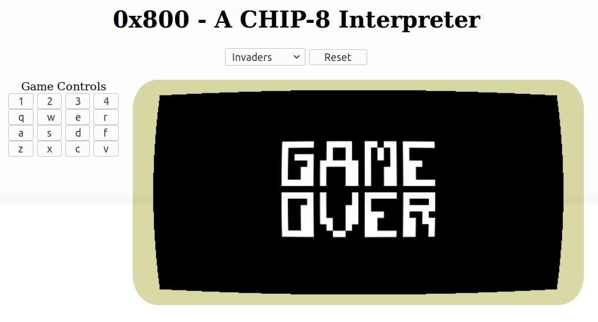

# 0x800 - A WebGL powered CHIP-8 Interpreter

https://adamjc.github.io/chip-8/

WebGL, shaders, all that jazz. Smoooth pure 60fps retro action.

Uses phaser to handle all the webgl stuff because I'm way too lazy to deal with it myself.

Thanks to CowGod's CHIP-8 Technical Reference: http://devernay.free.fr/hacks/chip8/C8TECH10.HTM#2.1